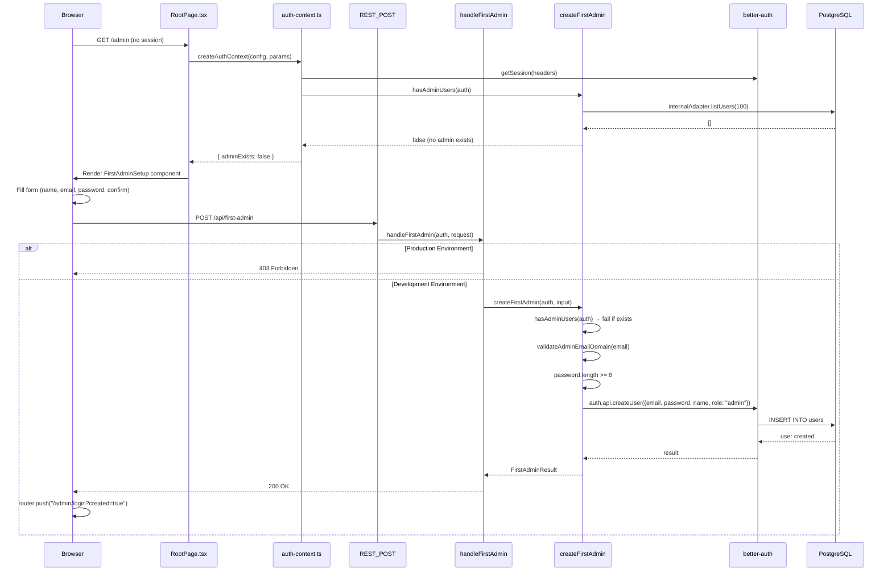
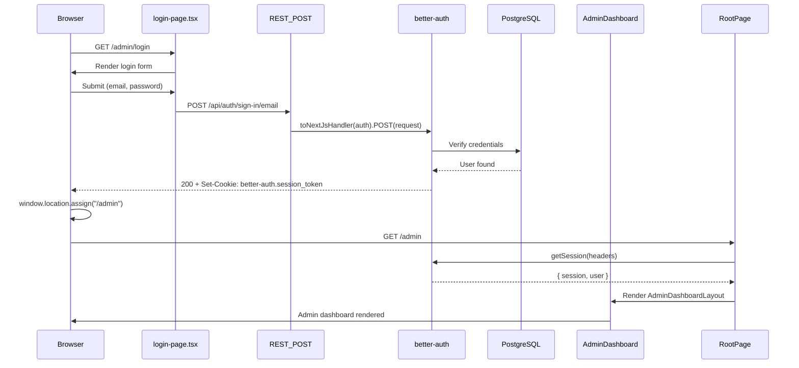
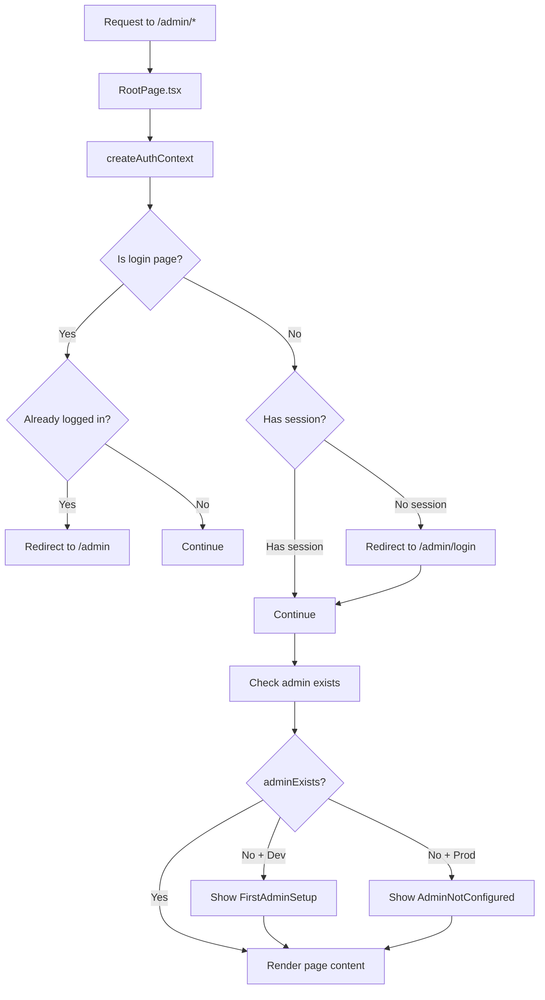
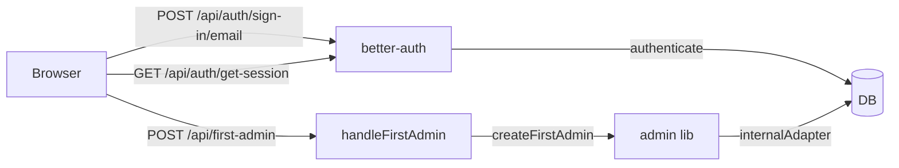
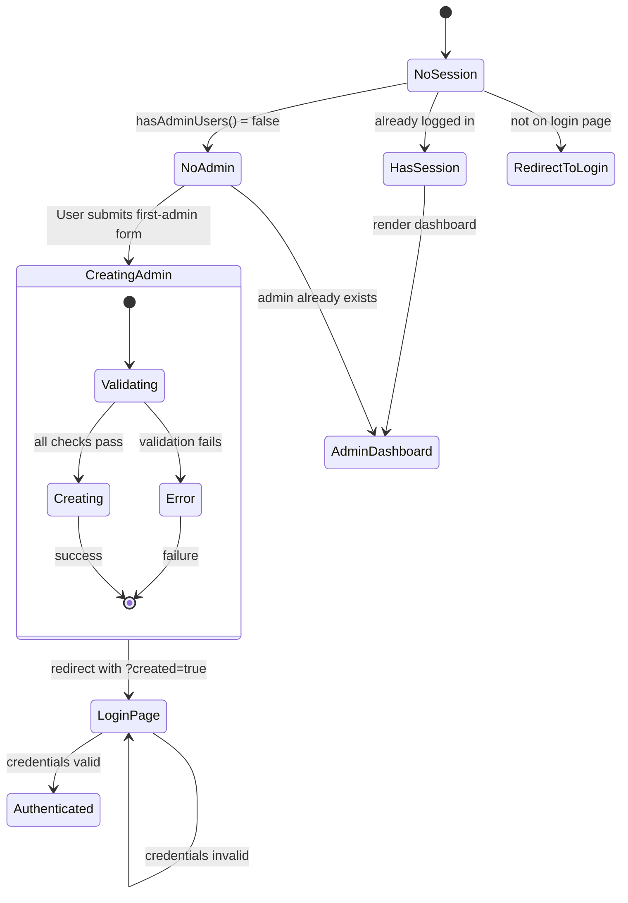

# DeesseJS Admin Authentication & First Admin Creation Flow

**Report generated:** 2026-04-17
**Project:** DeesseJS - Headless CMS for Next.js
**Version:** v0.0.1 (Early Development)

---

## 1. Architecture Overview

### 1.1 System Components

```mermaid
graph TB
    subgraph Browser
        LoginForm[Login Page]
        FirstAdminForm[First Admin Setup]
    end

    subgraph Next.js App
        RootPage[RootPage.tsx]
        AuthContext[auth-context.ts]
        AdminDashboardLayout[AdminDashboardLayout]
    end

    subgraph API Layer
        REST_INDEX[REST_POST /api/*]
        FirstAdminHandler[handleFirstAdmin]
        BetterAuthHandler[better-auth handler]
    end

    subgraph Auth Core
        BetterAuth[better-auth]
        SessionCookie[Session Cookie]
    end

    subgraph Admin Package
        createFirstAdmin[createFirstAdmin]
        hasAdminUsers[hasAdminUsers]
        validateAdminEmailDomain[validateAdminEmailDomain]
    end

    subgraph Database
        DB[(PostgreSQL)]
        UsersTable[users table]
    end

    LoginForm -->|POST /api/auth/sign-in/email| REST_INDEX
    FirstAdminForm -->|POST /api/first-admin| REST_INDEX
    REST_INDEX -->|first-admin| FirstAdminHandler
    REST_INDEX -->|other| BetterAuthHandler
    BetterAuthHandler -->|authenticate| BetterAuth
    BetterAuth -->|session| SessionCookie
    FirstAdminHandler -->|createFirstAdmin| Admin Package
    Admin Package -->|internalAdapter.listUsers| DB
    BetterAuth -->|db adapter| DB
    RootPage -->|createAuthContext| AuthContext
    AuthContext -->|getSession| BetterAuth
```

### 1.2 Package Responsibilities

| Package | Role |
|---------|------|
| `@deessejs/admin` | Pure TypeScript logic (no React) - auth utilities, validation |
| `@deessejs/next` | React components and Next.js integration |
| `@deessejs/deesse` | Core CMS with better-auth configuration |
| `better-auth` | Authentication library (session, password auth) |

---

## 2. First Admin Creation Flow

Triggered when: no admin user exists AND `NODE_ENV !== "production"`



### 2.1 Step-by-Step Process

| Step | File | Action |
|------|------|--------|
| 1 | `root-page.tsx:16-17` | Calls `createAuthContext({ config, params })` |
| 2 | `auth-context.ts:49-51` | `auth.api.getSession({ headers })` checks existing session |
| 3 | `auth-context.ts:84` | `hasAdminUsers(auth)` checks if admins exist |
| 4 | `admin.ts:41-42` | `internalAdapter.listUsers(100)` bypasses auth middleware |
| 5 | `root-page.tsx:32` | Renders `<FirstAdminSetup />` (dev mode only) |
| 6 | `first-admin-setup.tsx:42-49` | Form submits to `/api/first-admin` |
| 7 | `index.ts:23-27` | Routes to `handleFirstAdmin` |
| 8 | `first-admin.ts:16-21` | Production guard: 403 if `NODE_ENV === "production"` |
| 9 | `first-admin.ts:35` | `hasAdminUsers(auth)` - fails if admin already exists |
| 10 | `validation.ts` | `validateAdminEmailDomain(email)` - checks domain |
| 11 | `first-admin.ts:55` | Password length validation (>= 8 chars) |
| 12 | `first-admin.ts:74-81` | `auth.api.createUser({ ..., role: "admin" })` |
| 13 | `first-admin-setup.tsx:53-54` | Redirect to `/admin/login?created=true` |

### 2.2 Key Validation Functions

**`packages/admin/src/lib/first-admin.ts:30-95`**
```typescript
export async function createFirstAdmin(
  auth: Auth,
  input: FirstAdminInput
): Promise<FirstAdminResult> {
  // 1. Check if admin already exists
  if (await hasAdminUsers(auth)) {
    throw new Error("Admin users already exist");
  }

  // 2. Validate email domain
  const emailValidation = validateAdminEmailDomain(input.email);
  if (!emailValidation.valid) {
    throw new Error(emailValidation.error);
  }

  // 3. Validate password length
  if (input.password.length < 8) {
    throw new Error("Password must be at least 8 characters");
  }

  // 4. Create user with admin role
  const result = await (auth.api as any).createUser({
    body: {
      email: input.email,
      password: input.password,
      name: input.name,
      role: "admin",
    },
  });

  return { success: true, userId: result.user.id };
}
```

---

## 3. Regular Admin Login Flow

Triggered when: user navigates to `/admin/login`



### 3.1 Login Form Submission

**`packages/next/src/components/pages/login-page.tsx:15-40`**
```typescript
async function handleSubmit(e: React.FormEvent) {
  e.preventDefault();
  setLoading(true);
  setError("");

  try {
    const response = await fetch("/api/auth/sign-in/email", {
      method: "POST",
      headers: { "Content-Type": "application/json" },
      body: JSON.stringify({ email, password }),
    });

    if (response.ok) {
      globalThis.window?.location.assign("/admin");
    } else {
      const data = await response.json() as { message?: string };
      setError(data.message || "Invalid credentials");
    }
  } catch {
    setError("An error occurred. Please try again.");
  } finally {
    setLoading(false);
  }
}
```

### 3.2 Better-Auth Configuration

**`packages/deesse/src/server.ts:12-24`**
```typescript
const auth = betterAuth({
  database: drizzleAdapter(config.database, { provider: "pg" }),
  baseURL: config.auth.baseURL,
  secret: config.secret,
  emailAndPassword: { enabled: true },
  trustedOrigins: [config.auth.baseURL],
  plugins: config.auth.plugins,
});
```

---

## 4. Session Verification Flow

Every request to a protected route goes through this verification:



### 4.1 Auth Context Logic

**`packages/next/src/lib/auth-context.ts:46-79`**
```typescript
let session = null;
try {
  session = await auth.api.getSession({
    headers: requestHeaders,
  });
} catch (error) {
  console.error("[deesse] Session check failed:", error);
  session = null;
}

// Redirect logic
if (isLoginPage && session) {
  // Already logged in, redirect to admin
  redirect("/admin");
}

if (!isLoginPage && !session) {
  // Not logged in, redirect to login
  redirect("/admin/login");
}
```

---

## 5. Security Measures

### 5.1 Security Matrix

| Protection | Location | Implementation |
|------------|----------|----------------|
| First admin dev-only | `first-admin.ts:16-21` | Returns 403 in production |
| Admin pre-check | `first-admin.ts:35` | Fails if admin already exists |
| Email domain validation | `validation.ts` | Blocks public domains (gmail, yahoo, etc.) |
| Password minimum | `first-admin.ts:55` | Requires >= 8 characters |
| Session on every route | `auth-context.ts:77-79` | Redirects unauthenticated users |
| Internal adapter bypass | `admin.ts:41-42` | Avoids circular dependency |

### 5.2 Email Domain Validation

**`packages/admin/src/lib/validation.ts`**
```typescript
const PUBLIC_DOMAINS = ["gmail.com", "yahoo.com", "hotmail.com", "outlook.com", "icloud.com"];

export function validateAdminEmailDomain(email: string): { valid: boolean; error?: string } {
  const domain = email.split("@")[1]?.toLowerCase();

  if (!domain) {
    return { valid: false, error: "Invalid email format" };
  }

  if (PUBLIC_DOMAINS.includes(domain)) {
    return { valid: false, error: "Personal email domains are not allowed" };
  }

  return { valid: true };
}
```

### 5.3 Circular Dependency Prevention

**`packages/admin/src/lib/admin.ts:38-49`**

The `hasAdminUsers` function accesses the internal adapter directly because the `listUsers` API endpoint requires admin permissions. This creates a circular dependency when checking if an admin exists before the user is authenticated.

```typescript
export async function hasAdminUsers(auth: Auth): Promise<boolean> {
  try {
    // Access internal adapter directly - bypasses all auth middleware
    // This is necessary because listUsers API requires admin permissions
    const context = await auth.$context;
    const users = await context.internalAdapter.listUsers(100);
    return users.some((u: any) => u.role === "admin") ?? false;
  } catch (error) {
    console.error("[deesse] Failed to check admin users:", error);
    throw new Error("Failed to check admin users", { cause: error });
  }
}
```

---

## 6. API Routes Summary



| Endpoint | Handler | Purpose |
|----------|---------|---------|
| `POST /api/first-admin` | `handleFirstAdmin` | Create first admin (dev only) |
| `POST /api/auth/sign-in/email` | better-auth | Admin login |
| `GET /api/auth/get-session` | better-auth | Session verification |

---

## 7. File Reference Index

| File | Lines | Purpose |
|------|-------|---------|
| `packages/next/src/root-page.tsx` | 16-37 | Main entry point, renders based on auth state |
| `packages/next/src/lib/auth-context.ts` | 26-97 | Session check, admin existence, redirects |
| `packages/next/src/components/pages/login-page.tsx` | 9-83 | Login form UI |
| `packages/next/src/components/pages/first-admin-setup.tsx` | 17-134 | First admin creation form |
| `packages/next/src/api/rest/index.ts` | 17-34 | Routes requests to handlers |
| `packages/next/src/api/rest/admin/first-admin.ts` | 10-48 | Production guard + delegation |
| `packages/deesse/src/server.ts` | 12-24 | better-auth configuration |
| `packages/admin/src/lib/admin.ts` | 38-49 | hasAdminUsers via internal adapter |
| `packages/admin/src/lib/first-admin.ts` | 30-95 | createFirstAdmin validation logic |
| `packages/admin/src/lib/validation.ts` | full | Email domain validation |

---

## 8. State Diagram



---

**Report generated by Claude Code**
Using subagent exploration of: `packages/next/src/`, `packages/admin/src/`, `packages/deesse/src/`